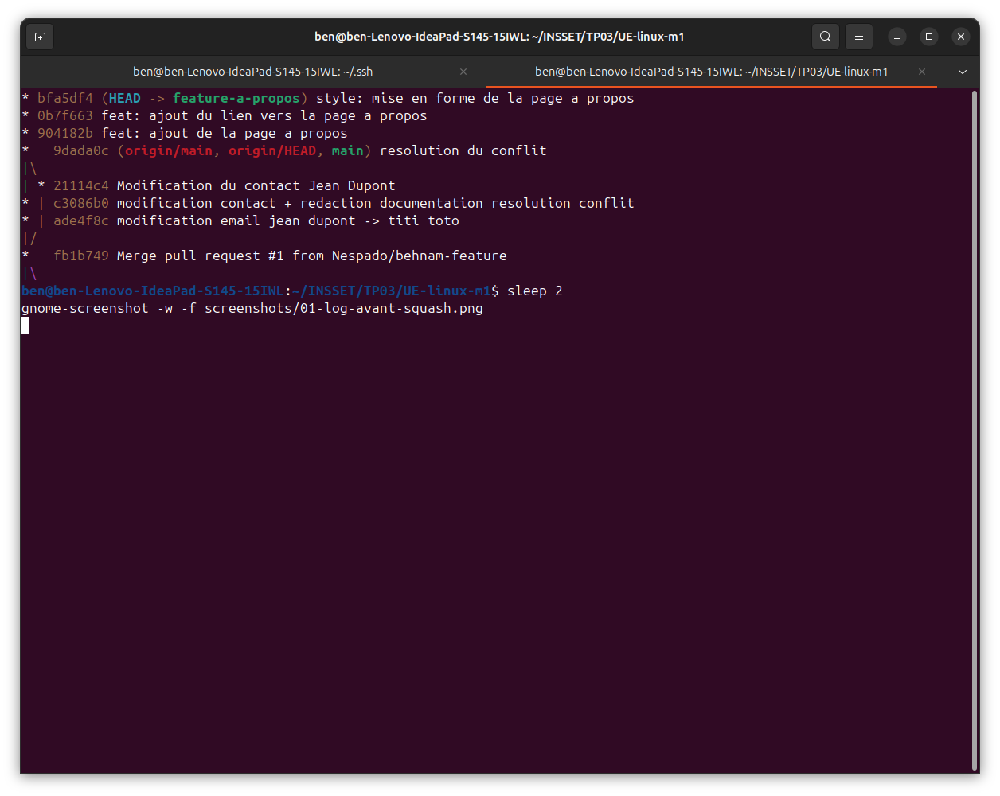
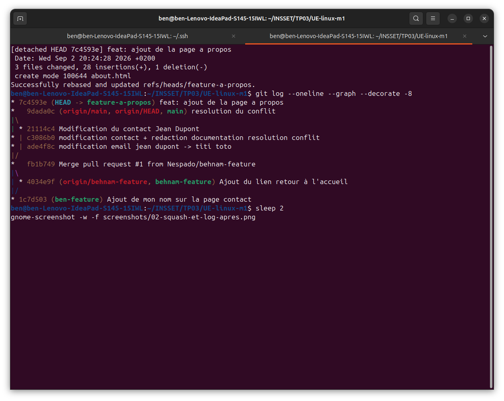

# Tentative de Push et Rejet (Conflit)

# Resolution du problème
## Étapes de résolution :
1. `git merge github/main`
2. Traitement du conflit de fusion apparu dans `contact.html`.
3. Nettoyage des balises de conflit (`<<<<<<<`, `=======`, `>>>>>>>`).
4. Validation de la résolution avec `git add contact.html` et `git commit`.
5. Envoi définitif des modifications résolues via `git push github main`.

---

## TP - Rebase interactif / Squash

### Historique avant le squash

La fonctionnalité a été développée en plusieurs commits.

### Rebase interactif et squash

Les différents commits de la fonctionnalité ont été regroupés avec un rebase interactif afin de présenter un historique propre avant la Pull Request.

