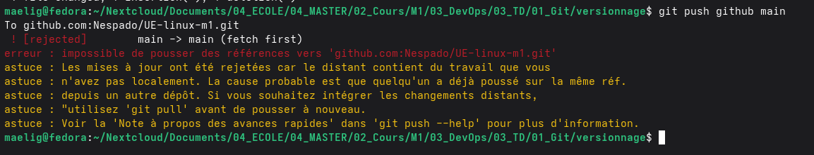

# Tentative de Push et Rejet (Conflit)

# Resolution du problème
## Étapes de résolution :
1. `git merge github/main`
2. Traitement du conflit de fusion apparu dans `contact.html`.
3. Nettoyage des balises de conflit (`<<<<<<<`, `=======`, `>>>>>>>`).
4. Validation de la résolution avec `git add contact.html` et `git commit`.
5. Envoi définitif des modifications résolues via `git push github main`.
